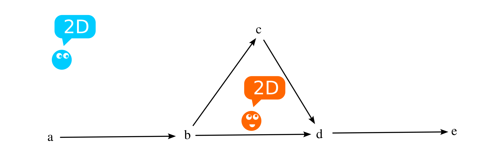
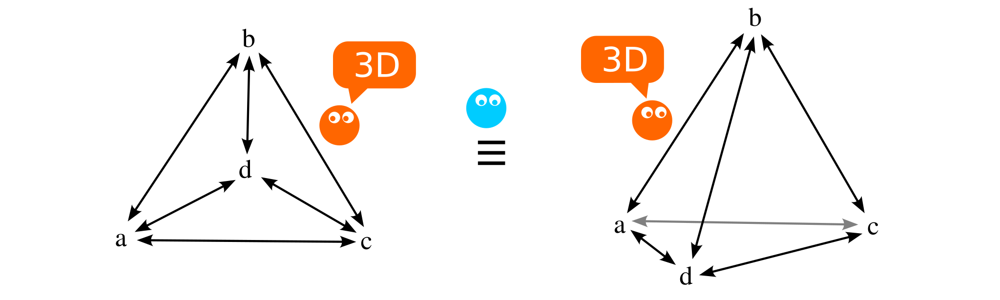
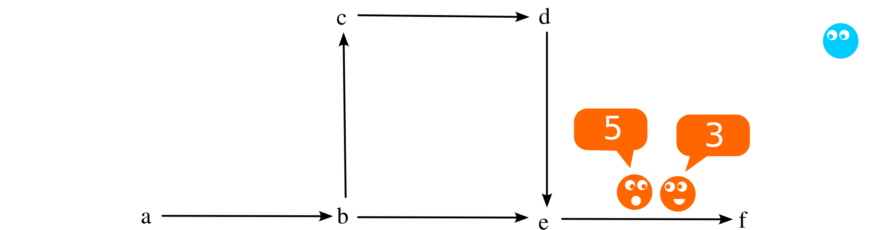
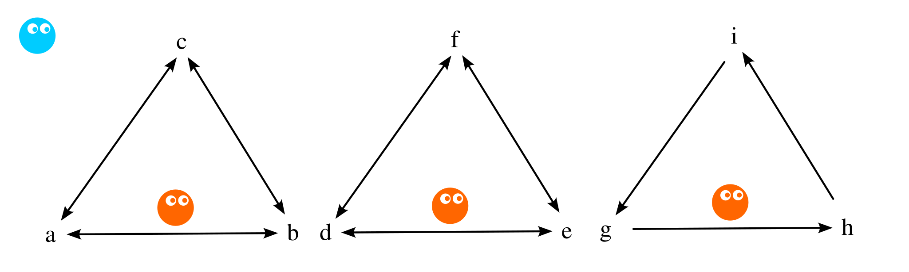
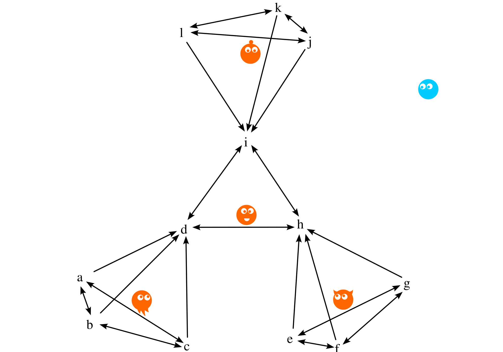

::: small
# Notes {#notes .unnumbered}

1.  doi:10.5281/zenodo.14319494
    <https://doi.org/10.5281/zenodo.14319494>

2.  Permanent link to the document \[en\]:
    <https://github.com/johnthesmith/flumen/blob/main/arxiv/export/flumen_en.pdf>

3.  The article is published under the license:
    <https://creativecommons.org/licenses/by-sa/4.0/> CC BY-SA 4.0
:::

# Introduction

The article describes the concept of modeling a set of multidimensional
spaces using abstract objects, aiming to describe multidimensional
structures with the minimal number of basic elements, excluding
traditional notions of coordinates and dimensions.

The concept is based on a single abstraction \"flumen\" for modeling
multidimensional spaces.

# Definition of Flumen

1.  Flumen (Latin flumen --- flow) --- an abstract one-way connection
    between two natural numbers (an oriented edge in a graph between two
    vertices). Importantly: a flumen, like a graph vertex, has no
    coordinates and does not belong to any space in the traditional
    sense. It is an abstraction that serves as the only building block
    (quantum) for creating spatial structures.

2.  A flumen is denoted as $f_{a,b}$, where $a \in 
                \mathbb{N}$ --- the first number, $b \in \mathbb{N}$ ---
    the second number.

3.  A specific naming convention has been introduced to separate the
    perception of the flumen as a spatial quantum from the mathematical
    concept of an edge in a graph.

## Properties of Flumen

From the definition of flumen, the following key properties follow:

-   Absence of coordinates: A flumen has no coordinates in the
    traditional sense; it represents only a directed union of two
    numbers.

-   Internal orientation: The direction of a flumen matters, similar to
    the directed edges of graphs.

-   Independence from space: A flumen is not tied to fixed spaces or
    geometry.

-   Composition: flumens can form sequences and structures, connecting
    with each other when the input or output number matches among a set
    of flumens.

-   Quantization: A flumen is a quantum and cannot be divided without
    losing its properties.

Note: In subsequent works, flumens may be considered with individual
weight coefficients, which will lead to changes in the presentation of
the material. However, for simplicity, identical flumens are considered
in this article.

## Operations on Flumens

Let the set of all flumens be denoted as $F$, where $a, b, \dots,
        n \in \mathbb{N}$. Then the following operations are possible:

1.  Creation of a set of flumens (C): $$F \leftarrow F \cup C(a,b,
                \dots, n)$$ Where the number of created flumens is
    $n-1$, with the indices used for sequentially creating pairs.
    Example: $$f_{a,b}=C(a,b)$$.

2.  Deletion of a set of flumens (D): $$F \leftarrow F \setminus
                D(a,b, \dots, n)$$ In this case, $n-1$ flumens will be
    removed if they are present in the set.

Both operations allow a set of argument groups and perform actions on
the set of flumens. Example:

$$F[f_{a,b}, f_{b,c}, f_{a,c}] = C[(a,b,c), (a,c)]$$.

# Observers

The definitions of Internal and External observers are not part of the
concept, but they facilitate the understanding of the material further.

## Internal Observer

The internal observer perceives space through interaction with flumens.
All characteristics, such as coordinates and directions, are limited by
the relations within the model. The internal observer is unaware of
external viewpoints. For the internal observer, a flumen is a quantum of
space. The perception of the properties of space by the internal
observer in the flumen model depends on the completeness of the
available information.

{#fig:image
width="\\textwidth"}

## External Observer

The external observer perceives the model as a whole, without the
limitations of coordinates and internal laws. They evaluate the
structure of the system as a set of flumens, without binding to its
internal rules. For the external observer, a flumen is a pair of natural
numbers. The external observer may, but is not required to, interpret
configurations of flumens as spaces.

{#fig:image
width="\\textwidth"}

# One-Dimensional Bounded Unidirectional Space

1.  We create the first flumen $F[f_{a,b}]=C(a,b)$, which forms a space
    bounded by a single quantum. For the internal observer, the space is
    zero-dimensional, existing only within the flumen, and beyond it
    there is nothing.

    {#fig:image width="\\textwidth"}

    Important: The images should not be perceived as coordinate spaces
    with points and connections.

2.  We add the second flumen $f_{c,d}=C(c,d)$, which creates its own
    independent space, not related to $f_{a,b}$. These spaces have no
    mutual arrangement or distance between them.

    {#fig:image
    width="\\textwidth"}

3.  We add the flumen $f_{b,c}=C(b,c)$. Now, all three flumens merge
    into a single one-dimensional space, bounded by three quanta. For
    the internal observer, relative coordinates can be established. For
    example, if the flumen $f_{b,c}$ is set as the origin, then
    $f_{c,d}$ will have a coordinate of +1. However, since the flumens
    are unidirectional, $f_{a,b}$ does not exist for $f_{b,c}$, and its
    coordinates remain undefined.

    {#fig:image width="\\textwidth"}

# One-Dimensional Bidirectional Space

1.  To convert the space into a bidirectional one, it is enough to add
    the flumens: $$[f_{d,c}, f_{c,b}, f_{b,a}]=C(d,c,b,a)$$ For
    convenience, pairs such as $f_{a,b}$ and $f_{b,a}$ are represented
    as a single line with two arrows.

    {#fig:image width="\\textwidth"}

2.  The flumens create additional directions within the existing
    one-dimensional space. As a result, the internal observer will
    perceive the space as bidirectional, sensing movement in both
    directions, rather than just in one direction as before.

3.  Now, the observer from $f_{b,c}$ and $f_{c,b}$ can operate with both
    negative and positive coordinates, depending on their own formal
    rules. Thus, $f_{a,b}$ will have a coordinate of -1, while $f_{c,d}$
    will have a coordinate of +1.

# Two-Dimensional Space

1.  Let's recreate the flumens
    $[f_{a,b},f_{b,c},f_{c,d},f_{d,e},f_{b,d}]=C[(a,b,c,d,e),(a,c)]$;

    {#fig:image
    width="\\textwidth"}

2.  For the internal observer, there are two paths from $f_{a,b}$ to
    $f_{d,e}$ with different numbers of flumens (three and four). This
    is impossible in one-dimensional space, but is allowed in
    two-dimensional space, which the internal observer can recognize.
    The external observer perceives only the collection of flumens. They
    are not required to interpret the structure as two-dimensional, but
    they may choose to view it as such, based on the internal properties
    of the model.

3.  The two-dimensional space can be expanded by adding new flumens.

# Spaces of Mixed Dimensions

1.  Let's add the flumens $f_{e,f}=C(e,f)$ to the previous set.

    {#fig:image width="\\textwidth"}

2.  For the internal observer, the action within $f_{b,c}, 
                f_{c,d}, f_{b,d}$ remains two-dimensional, but
    $f_{d,e}, f_{e,f}$ is perceived as one-dimensional, as there is a
    single path in that section.

3.  This approach allows describing spaces with sections of different
    dimensions, while maintaining the internal consistency of the model.

# Three-dimensional space and other dimensions

1.  Let's create the flumens as follows: $$F =
                C[(a,b,c,b,a), (a,d,c,d,a), (a,c,a), (d,b,d)]$$.

    {#fig:image
    width="\\textwidth"}

2.  From the perspective of the External observer, the topology of the
    two fragments shown above is identical. However, it is important to
    remember that all the flumens are identical, and each will be
    perceived by the Internal observer as a unit of space. When studying
    the space, the Internal observer will be forced to recognize the
    space as three-dimensional. Therefore, from their point of view, one
    can speak of three-dimensional coordinates.

3.  For higher dimensions, such as four-dimensional space, the same
    reasoning applies.

    {#fig:image width="\\textwidth"}

# Compact spaces

1.  Let's create a two-dimensional space for the internal observer in a
    way different from before, for example:
    $F[f_{a,b},f_{b,c},f_{c,a}] = C(a,b,c,a)$.

    {#fig:image width="\\textwidth"}

2.  $f_{a,b},f_{b,c},f_{c,a}$ form a closed seamless one-dimensional
    space for the Internal observer. The Internal observer can move
    infinitely in one direction.

3.  However, the External observer may interpret the movement from
    flumen to flumen as motion in a two-dimensional space.

4.  In a similar way, closed spaces of any dimension and configuration
    can be obtained, and it is possible to speak about their closure
    through higher dimensions.

# \"Artifacts of Fluemen\"

By artifacts, we refer to the appearance of patterns that are absent in
the original data. The examples provided are just a small part of the
specific consequences of applying fluemen.

## \"Wormholes\"

1.  Fluemen can form \"wormholes\" without the need for \"curving
    space,\" since at a fundamental level, space is not described.
    Example: $$F = C[(a,b,c,d,e,f),(b,c)]$$

    {#fig:image
    width="\\textwidth"}

2.  The one-dimensional space, represented by fluemen
    $f_{a,b}, f_{b,c}, f_{c,d}, f_{d,e}, f_{e,f}$, is linear, uniform,
    and continuous. Its length is 5 quanta.

3.  Fluemen $f_{b,c}$ creates an alternative path from $f_{a,b}$ to
    $f_{e,f}$ with a length of 3 quanta, which can be interpreted as a
    \"wormhole\" from the perspective of the first linear path.

4.  Such structures can be formed in spaces of any dimension, allowing
    fluemen to model complex topologies.

## \"Parallel Spaces\"

1.  Fluemen describe \"parallel spaces,\" modeling identical or
    partially different realities for observers. Example: $$F = 
                    C[(a,b,c,a,c,b,a), (d,e,f,d,f,e,d), (g,h,i,g)]$$

    {#fig:image
    width="\\textwidth"}

2.  Observers cannot leave their subspaces and interact with each other,
    while remaining in identical or nearly identical conditions.

## Domains

1.  The described spaces can be significantly more complex than standard
    uniform ones, such as Cartesian spaces. For example, the space of
    the Internal observer, consisting of fluemen
    $f_{d,h}, f_{h,d}, f_{h,i}, f_{i,h}, f_{i,d}, 
                    f_{d,i}$, is one-dimensional and compact. However,
    it is part of three domains $abcd$, $efgh$, and $ijkl$, which lie
    beyond the perception of the Internal observer. These domains exceed
    the dimensionality of the observer's space and can influence it.

    {#fig:image width="\\textwidth"}

# Applicability of Fluemen

In addition to the examples and artifacts discussed, fluemen can be
useful for solving a number of other problems, such as:

1.  Explaining the unidirectionality of time in multidimensional spaces,
    which can be linked to symmetry principles in physics.

2.  Modeling the interconnection of multiple spaces of different
    dimensions, topologies, and structures, for example, using domains
    ([branes](https://en.wikipedia.org/wiki/Brane)).

3.  Introducing the weight of fluemen allows its interpretation as a
    deviation from the constant size of quanta, which in turn will
    enable describing the dependence of the curvature of space on the
    \"energy\" of its quanta in each individual region of space.

# Summary

Fluemen offer a generalized method for modeling spaces with varying
dimensions, properties, and artifacts. Through a set of pairs of natural
numbers, they form the topology, configuration, and other
characteristics of these spaces.

::: thebibliography
9

Wiki *Directed graph* <https://en.wikipedia.org/wiki/Directed_graph>

Hall, D. F. *Introduction to Graph Theory*. Prentice-Hall, 1977.

Greene, B. *The Elegant Universe: Superstrings, Hidden Dimensions, and
the Quest to Understand the Ultimate Nature of Reality*. W.W. Norton &
Company, 2000.
:::
