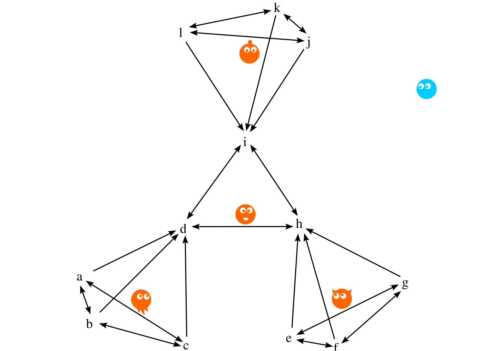

::: small
# Примечания {#примечания .unnumbered}

1.  doi:10.5281/zenodo.14319494
    <https://doi.org/10.5281/zenodo.14319494>

2.  Постоянный адрес документа \[ru\]:
    <https://github.com/johnthesmith/flumen/blob/main/arxiv/export/flumen_ru.pdf>

3.  Постоянный адрес документа \[en\]:
    <https://github.com/johnthesmith/flumen/blob/main/arxiv/export/flumen_en.pdf>

4.  Статья опубликована под лицензией:
    <https://creativecommons.org/licenses/by-sa/4.0/> CC BY-SA 4.0
:::

# Введение

Статья описывает концепцию моделирования множества многомерных
пространств посредством абстрактных объектов, стремится описать
многомерные структуры с помощью минимального количества исходных
элементов, исключая традиционные понятия координат и измерений.

Концепция основана на единственной абстракции "флюмен", для
моделирования многомерных пространств.

# Определение флюмена

1.  флюмен (лат flumen --- поток) --- абстрактная однонаправленная связь
    двух натуральных чисел (ориентированное ребро графа между двумя
    вершинами). Важно: флюмен как и вершина графа не имеет координат и
    не принадлежит какому-либо пространству в традиционном понимании.
    Это абстракция, которая служит единственным строительным блоком
    (квантом) для создания пространственных структур.

2.  Обозначается флюмен как $f_{a,b}$ где $a \in \mathbb{N}$ --- первое
    число, $b \in \mathbb{N}$ --- второе число.

3.  Специфическое наименованию введено для отделения восприятия флюмена
    как пространственного кванта от математического понятия ребра графа.

## Свойства флюмена

Из определения флюмена вытекают следующие ключевые свойства:

-   Отсутствие координат: флюмен не имеет координат в традиционном
    смысле, он представляет собой лишь направленное объединение двух
    чисел.

-   Внутренняя ориентированность: Направление флюмена имеет значение,
    аналогично ориентированным ребрам графов.

-   Независимость от пространства: флюмен не связан с фиксированными
    пространствами или геометрией.

-   Композиция: флюмены могут образовывать последовательности и
    структуры, связываясь между собой при условии совпадения входного
    или выходного числа у множества флюменов.

-   Квантование: флюмен является квантом, и не может быть разделен без
    потери своих свойств.

Примечание: В последующих работах флюмены могут рассматриваться с
индивидуальными весовыми коэффициентами, что приведет к изменениям в
изложении материала. Однако в данной статье для упрощения
рассматриваются идентичные флюмены.

## Операции над флюменами

Пусть множество всех флюменов обозначается как $F$, при этом
$a, b, \dots, 
        n \in \mathbb{N}$. Тогда возможны следующие операции:

1.  Создание множества флюменов (C): $$F \leftarrow F \cup C(a,b, 
                \dots, n)$$ Где количество созданных флюменов равно
    $n-1$, при этом индексы используются для последовательного создания
    пар. Пример: $$f_{a,b}=C(a,b)$$.

2.  Удаление множества флюменов (D): $$F \leftarrow F \setminus 
                D(a,b, \dots, n)$$ В этом случае будет удалено $n-1$
    флюменов, если они присутствуют в множестве.

Обе операции допускают множество групп аргументов и выполняют действие
над множеством флюменов. Пример:

$$F[f_{a,b}, f_{b,c}, f_{a,c}] = C[(a,b,c), (a,c)]$$.

# Наблюдатели

Определение Внутреннего и Внешнего наблюдателей не являются частью
концепции но облегчают понимание материала в дальнейшем.

## Внутренний наблюдатель

Внутренний наблюдатель воспринимает пространство через взаимодействие с
флюменами. Все характеристики, такие как координаты и направления,
ограничены отношениями внутри модели. Он не осознает внешние точки
зрения. Для внутреннего наблюдателя флюмен является квантом
пространства. Восприятие свойст пространства Внутренним наблюдателем во
флюмен модели зависит от полноты доступной информации.

{#fig:image
width="\\textwidth"}

## Внешний наблюдатель

Внешний наблюдатель воспринимает модель целиком, без ограничений
координат и внутренних законов. Он оценивает структуру системы
какмножество флюменов, без привязки к ее внутренним правилам. Для
внешнего наблюдателя флюмен это пара натуральных чисел. Вншений
наблюдатель может, но не обязан итерпритировать конфигурации флюменов
как пространства.

{#fig:image
width="\\textwidth"}

# Одномерное ограниченное однонаправленное пространство

1.  Создадим первый флюмен $F[f_{a,b}]=C(a,b)$, который формирует
    ограниченное одним квантом пространство. Для внутреннего наблюдателя
    пространство нольмерно, существует лишь в рамках флюмена, и за его
    пределами ничего нет.

    {#fig:image width="\\textwidth"}

    Важно: Рисунки не следует воспринимать как координатные пространства
    с точками и связями.

2.  Добавляем второй флюмен $f_{c,d}=C(c,d)$, который создает свое
    собственное независимое пространство, не связанное с $f_{a,b}$. Эти
    пространства не имеют взаимного расположения или расстояния между
    собой.

    {#fig:image
    width="\\textwidth"}

3.  Добавляем флюмен $f_{b,c}=C(b,c)$. Теперь все три флюмена
    объединяются в единое одномерное пространство, ограниченное тремя
    квантами. Для внутреннего наблюдателя можно установить относительные
    координаты. Например, если флюмен $f_{b,c}$ будет началом координат,
    то $f_{c,d}$ будет иметь координату +1. Однако, поскольку флюмены
    однонаправлены, то $f_{a,b}$ не существует для для $f_{b,c}$, и её
    координаты остаются неопределёнными.

    {#fig:image width="\\textwidth"}

# Одномерное многонаправленное пространство

1.  Чтобы преобразовать пространство в многонаправленное, достаточно
    добавить флюмены: $$[f_{d,c}, f_{c,b}, f_{b,a}]=C(d,c,b,a)$$ Для
    удобства пары вроде $f_{a,b}$ и $f_{b,a}$ отобразим одной линеей с
    двумя стрелками.

    {#fig:image width="\\textwidth"}

2.  Флюмены создадут дополнительные направления в рамках существующего
    одномерного пространства. В результате внутренний наблюдатель сможет
    осознавать пространство как многонаправленное, воспринимая движение
    в обе стороны, а не только в одном направлении, как это было ранее.

3.  Теперь наблюдатель из $f_{b,c}$ $f_{c,b}$ может оперировать
    отрицательными и положительными координатами, в зависимости от
    собственных формальных правил. Так $f_{a,b}$ будет иметь координату
    -1, а $f_{c,d}$ будет иметь координату +1.

# Двумерное пространство

1.  Создадим заново флюмены
    $[f_{a,b},f_{b,c},f_{c,d},f_{d,e},f_{b,d}]=C[(a,b,c,d,e),(a,c)]$;

    {#fig:image
    width="\\textwidth"}

2.  Для внутреннего наблюдателя из $f_{a,b}$ в $f_{d,e}$ существуют два
    пути с разным количеством флюменов (три и четыре). Такое невозможно
    в одномерном пространстве, но допускается в двумерном, что и
    позволяет его осознать. Внешний наблюдатель воспринимает только
    совокупность флюменов. Он не обязан интерпретировать структуру как
    двумерную, но при желании может рассматривать её таким образом,
    исходя из внутренних свойств модели.

3.  Наращивать двумерное пространство можно путем добавления новых
    флюменов.

# Пространства смешанных размерностей

1.  К предыдущему множеству добавим флюмены $f_{e,f}=C(e,f)$.

    {#fig:image width="\\textwidth"}

2.  Для внутреннего наблюдателя действие в пределах
    $f_{b,c},f_{c,d},f_{b,d}$ остаётся двумерным, но $f_{d,e},f_{e,f}$
    воспринимается как одномерное, так как на этом участке существует
    единственный путь.

3.  Такой подход позволяет описывать пространства с участками различной
    размерности, сохраняя внутреннюю согласованность модели.

# Трехмерное пространство и иные размерности

1.  Создадим флюмены следующим образом: $$F = 
                C[(a,b,c,b,a), (a,d,c,d,a), (a,c,a), (d,b,d)]$$.

    {#fig:image
    width="\\textwidth"}

2.  С точки зрения Внешнего наблюдателя топология двух выше приведенных
    фрагментов идентична. Однако следует помнить, что все флюмены
    идентичны, и каждый будет восприниматься Внутренним наблюдателем как
    единичная мера пространства. При изучении пространства Внутренний
    наблюдатель будет вынужден признать пространство трехмерным.
    Соответсвнно с его точки зрения можно будет говорить о трехмерных
    координатах.

3.  Для более высоких размерностей, например, четырехмерного
    пространства, действуют аналогичне рассуждения.

    {#fig:image
    width="\\textwidth"}

# Компактные пространства

1.  Создадим для внутреннего наблюдателья двумерное пространство иным
    способом чем ранее, например так:
    $F[f_{a,b},f_{b,c},f_{c,a}] = C(a,b,c,a)$.

    {#fig:image width="\\textwidth"}

2.  $f_{a,b},f_{b,c},f_{c,a}$ формируют для Внутреннего наблюдателя
    замкнутое бесшовное одномерное пространство. Внутренний наблюдатель
    может бесконечно двигаться в одном направлении.

3.  При этом внешний надблюдатель, может интепритировать перемещения от
    флюмена к флюмену как движение в двумерном пространстве.

4.  Аналогичным образом можно получить замкнутые пространства любой
    размерности и любой конфигурации, при этом можно говорить об их
    замыкании через высшие измерения.

# Артефакты флюменов

Под артефактами далее понимаем появление закономерностей, отсутствующих
в исходных данных. Приведенные примеры лишь небольшая часть
специфических последствий применения флюменов.

## \"Кротовые норы\"

1.  Флюмены могут формировать \"кротовые норы\" без необходимости
    \"искривления пространства\", поскольку на фундаментальном уровне
    оно не описывается. Пример: $$F = C[(a,b,c,d,e,f),(b,c)]$$

    {#fig:image
    width="\\textwidth"}

2.  Одномерное пространство, представленное флюменами $f_{a,b}, 
                    f_{b,c}, f_{c,d}, f_{d,e}, f_{e,f}$, линейно,
    равномерно и непрерывно. Его длина составляет 5 квантов.

3.  Флюмен $f_{b,c}$ создает альтернативный путь от $f_{a,b}$ до
    $f_{e,fb}$ длинной 3 кванта, что может быть интерпретировано как
    \"кротовая нора\" с точки зрения первого линейного пути.

4.  Подобные структуры могут быть сформированы в пространствах любой
    размерности, что позволяет использовать флюмены для моделирования
    сложных топологий.

## \"Параллельные\" пространства

1.  Флюмены описывают \"параллельные пространства\", моделируя
    идентичные или частично отличные реальности для наблюдателей.
    Пример: $$F = C[(a,b,c,a,c,b,a), (d,e,f,d,f,e,d), (g,h,i,g)]$$

    {#fig:image
    width="\\textwidth"}

2.  Наблюдатели не могут покинуть свои подпространства и
    взаимодействовать между собой, при этом оставаясь в одинаковых или
    почти одинаковых условиях.

## Домены

1.  Описываемые пространства могут быть значительно сложнее стандартных
    равномерных, таких как декартовы. Например, пространство,
    Внутреннего наблюдателя, состоящее из флюменов
    $f_{d,h}, f_{h,d}, f_{h,i}, f_{i,h}, f_{i,d}, f_{d,i}$, является
    одномерным и компактным. Однако оно - часть трех доменов $abcd$,
    $efgh$ и $ijkl$, которые находятся за пределами восприятия
    Внутреннего наблюдателя. При этом домены превосходят размерность
    пространства Наблюдателя и могут на него воздействовать.

    {#fig:image width="\\textwidth"}

# Применимость флюменов

В дополнение к рассмотренным примерам и Артефактам, флюмены могут быть
полезны для решения ряда иных задач, таких как:

1.  Объяснение однонаправленности времени в многомерных пространствах,
    что можно связать с принципами симметрии в физике.

2.  Моделирование взаимосвязи множества пространств различной
    размерности, топологий и структур, например, с помощью доменов
    ([браны](https://en.wikipedia.org/wiki/Brane)).

3.  Введение веса флюменов, допускает его интерпретацию как отклонение
    от константного размера квантов, что в свою очередь позволит
    описывать зависимость кривизны пространства от \"энергии\" его
    квантов в каждой отдельной области пространства.

# Резюме

Флюмены предлагают обобщенный метод моделирования пространств с
различными размерностями, свойствами и артефактами. Через множество пар
натуральных чисел они формируют топологию, конфигурацию и другие
характеристики этих пространств.

::: thebibliography
9

Wiki *Directed graph* <https://en.wikipedia.org/wiki/Directed_graph>

Hall, D. F. *Introduction to Graph Theory*. Prentice-Hall, 1977.

Greene, B. *The Elegant Universe: Superstrings, Hidden Dimensions, and
the Quest to Understand the Ultimate Nature of Reality*. W.W. Norton &
Company, 2000.
:::
