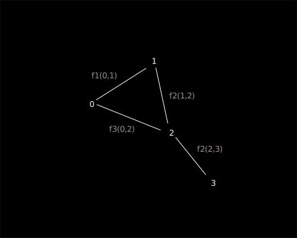
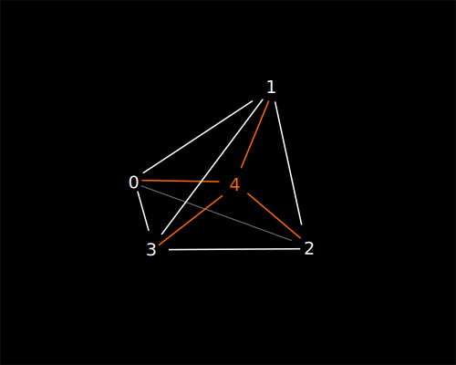
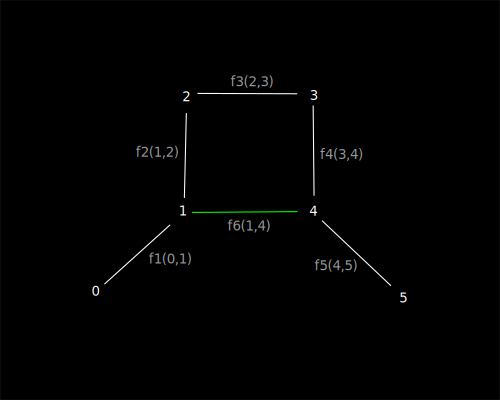

> :information_source: The creation of a universal space of any dimension, topology, 
and complexity should begin with pairs of natural numbers and end with them as well.
Cherkas R.

# Introduction

[ru](../ru/flumen-intro.md)

1. Let’s try to create the simplest possible space, without relying on coordinates, 
measurements, directions, or other formal constructs. All of them should arise 
from the basic principle, but not require explicit definition.

# In the Beginning was the Word

1. We declare [Flumen](./flumen.md) (lat. stream, ru. поток) — a pair of natural 
numbers connected by a unit direction from the first number to the second. The 
direction does not depend on the values of the numbers (analogous to a 
directed edge in a graph), denoted as F(a,b).

# Let There Be Space

1. Let's create the first flumen f1 = F(0,1). It is the only existing one, and by its appearance, it creates its own one-dimensional space, beyond which there is nothing.

> :warning: Important for understanding. Do not try to interpret all illustrations as coordinate spaces where points are placed and connected. 
The illustrations are only an attempt at visualization; flumens implicitly form the space themselves.

2. Now, create the second flumen f2 = F(2,3). It also creates its own space, independent of f1. 
It is impossible to talk about the relative position of the flumens or the distance between them. 
These are two isolated, independent spaces.

3. Add flumen f3 = F(1,2). Now all three flumens merge into a single one-dimensional space, 
where each flumen is the smallest unit quantum of this space.

For an internal observer in the space, coordinates can be assigned to the points relative to each other. 
For example, if point 1 is set as the origin, then point 3 will have a coordinate of +2. 
However, since the flumens are one-directional, point 0 does not exist in the measurement for point 1, 
and its coordinates are undefined.

4. Such a one-dimensional space can be extended indefinitely by adding new points at the ends.

> :information_source: And this is good.

## Two-Dimensional Space

1. Let's create the flumens differently: f1 = F(0,1), f2 = F(1,2), f3 = F(0,2).

2. From number 0 to number 2, there are two paths for the observer, each with a different number of flumens. 
In other words, the length of the path for the observer from 0 to 2 differs, which is impossible in a 
one-dimensional observer space, but permissible in a two-dimensional space. Conclusion: 
the observer can describe the space as two-dimensional, while from the external observer's point of view, 
the second dimension hasn't been explicitly defined.

3. Such a two-dimensional space can also be extended indefinitely by adding new flumens.

## Spaces of Mixed Dimensions

1. Let's add the flumen f4 = F(2,3) to the previous example.

2. For an internal observer, movements between points 0, 1, and 2 remain two-dimensional, but movement from point 2 to point 3 will be one-dimensional. Thus, in a single model, both two-dimensional and one-dimensional spaces are described.

## Three-Dimensional Space and Higher Dimensions

1. Let's add three more flumens: f5 = F(0,4), f6 = F(1,4), f7 = F(4,2).

2. Similarly to the two dimensions, a three-dimensional space is formed, where we can talk about three-dimensional coordinates for each of the points. However, the seamless transition between spaces of different dimensions is still preserved for the internal observer.

3. In the same way, the model can be extended for the internal observer to any dimension, for example, 4D.

## Closed Finite Spaces

1. Let's create a two-dimensional space with flumens in a different way than before, for example: f1=F(0,1), f1=F(1,2), f1=F(2,0).

2. Points 0, 1, and 2 form a closed seamless one-dimensional measurement for the observer. The internal observer can move endlessly in one direction.

3. From the external observer's perspective, the movement takes place in a two-dimensional measurement.

4. Similarly, closed spaces of any dimension and configuration can be obtained, and they can be "closed" through higher dimensions.

## Wormholes

1. Flumens allow the formation of wormholes without the need to curve spaces (since, in essence, they do not exist).

2. The one-dimensional space from 0 to 5 is linear, uniform, continuous, and has a length of 5 units.

3. Meanwhile, flumen f6(1,4) adds an alternative linear, continuous space from 0 to 5 with a length of 3 units, which is effectively a wormhole.

4. A similar result can be achieved for any dimension.

## Space Expansion and Curvature

1. Flumens allow for arbitrary expansion of both the entire space and its individual regions.
0. To stretch the space, it is sufficient to create new flumens in place of previously created ones.
0. In the case of non-uniform expansion of spaces with two or more dimensions, one can talk about curvature through higher dimensions.

## Domains

1. It is allowed to create isolated regions of spaces (flumendoms), which can be connected by transitions or be completely isolated from each other.
In the latter case, internal observers from two isolated flumendoms will neither meet nor be aware of each other's existence.

## Conclusion

1. From nothing, we have created an expandable multidimensional space. It is still empty and static.
Although we have already discussed length and size, time, motion, and velocity are yet to be defined in space, but they are close.

Let there be light!

# Links

1. [Flumen Theory](./README.md)
