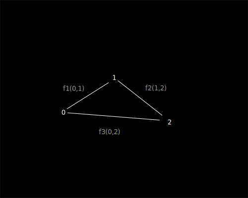

> :information_source: Cоздание универсального пространства любой размерности 
топологии и сложности, следует начинать с пар натуральных чисел и не более.

# Вступление

1. Попробуем создать собственное пространство, максимально простое, не основываясь 
на координатах, измерениях, направлениях и прочих формальных конструктах. Все они 
должны проистекать из базового принципа, но не требовать явного определения.

# Сначало было слово

1. Декларируем [Flumen](./flumen.md)(lat поток, ru поток) - пара натуральных чисел объединенных 
единичным направлением от первого ко второму числу, при этом направление не зависит 
от значения чисел (аналог ориентированного ребра графа), обозначается как F(a,b).

# Да будет пространство

1. Создадим первый флюмен f1 = F(0,1). Он единственное сущее, своим появлением 
порождает собственное одномерное пространство за пределами которго нет ничего.

> :warning: Важно для понимания. Не следует пытаться трактовать все рисуноки 
как координатные пространства в которых размещены точки и связи между ними. 
Рисунки - лишь попытка иллюстрации, флюмены сами неявно формируют пространство.

2. Создаем второй флюмен f2 = F(2,3). Он так же создает собственное пространство, 
не связанное с f1. Невозможно говорить о взаимном положение флюменов и расстоянии 
между ними. Это два независимых изолированных пространства.

3. Добавим флюмен f3 = F(1,2). При этом все три флюмена объединяются в единое одномерное 
пространство, где каждый является мельчайшим единичным квантом этого пространства.

Для внутреннего наблюдателя в пространстве для точек могут быть названы координаты, 
относительно друг друга. Например если точка 1 будет началом координат, то точка 3 будет 
иметь координату +2 . При этом, так как флюмены однонаправлены, точка 0 не существует 
в измерении для точки 1 и ее координаты не определимы.

4. Наращивать такое одномерное пространство можно сколь угодно, добавляя к крайним точкам новые.

> :information_source: И это хорошо. 

## Двумерное пространство

1. Создадим флюмены иначе f1 = F(0,1), f2 = F(1,2), f3 = F(0,2).

2. Из числа 0 к числу 3 для наблюдателя ведут два пути с разным количеством флюменов. 
Иными словами длинна пути для наблюдателя от 0 к 3 трем различна, что невозможно в одномерном 
пространстве наблюдателя, но допустимо в двумерном пространстве. Итог: наблюдатель может говорить 
о двумерном пространстве, при этом с точки зрения внешнего наблюдателя описание второго измерения
не производилось.
5. Наращивать такое двумерное пространство можно так же сколь угодно, расширяя 
его добавлением новых флюменов. 

## Пространства смешанных размерностей

1. Добавим к предыдущему примеру флюмен f4 = F(2,3).

2. Для внутреенго наблюдателя перемещения по точкам 0,1,2 остаются двумерными, 
но при этом перемещение о точки 2 к точки 3 будет одномерным, таким образом в 
единой модели описаны и двумерные и одномерные пространства.

## Трехмерное пространство и большие размерности

1. Добавим еще три флюмена f5 = F(0,4), f6 = F(1,4), f7 = F(4,2).

2. По аналогии с двумя измерениями формрируется трехмерное пространтство, 
где можно говорить о трехмерных координатах для каждой из точек, при этом по 
прежнему сохранятеся бесшовный пререход между пространствами разной 
размерности для внутреннего наблюдателя.
3. Таким же образом возможно расширение модели для внутреннего наблюдателя 
до любой размерности, например 4d. 

## Замкнутые конечные пространства

1. Создадим флюменами двумерное пространство иным способом чем ранее, например так: f1=F(0,1), f1=F(1,2), f1=F(2,0). 

2. Точки 0 1 и 2 формируют для наблюдателя замкнутое бесшовное одномерное измерение, 
внутренний наблюдатель может бесконечно двигаться в одном направлении.
3. При этом со стороны внешнего надблюдателя, движение осуществляется в двухмерном измерении.
3. Аналогичным образом можно получить замкнутые пространства любой размерности и любой конфигурации, 
при этом можно говорить об их замыкании через высшие измерения.

## Кротовые норы

1. Пространства флюменов допускают формирование кротовых нор без нобходимости искривления.

2. Одномерное пространство от точки p0 в точку p7 линейно, равномерно, неразрывно и имеет длинну 7 единиц.
3. При этом связь [p1, p6] добавляет альтернативное линейное неразрываное пространство от точки p0 до p7 длинной 3 единицы.
4. Аналогичный результат достижим для любой размерности.

## Расширение пространства и его кривизна

1. Допустимо произвольное расширение как всего пространства так и его отдельных областей.
Для растяжения достаточно создание новых точек и их связь с двумя соседними с удалением ранее существующей связи.
0. При неравномерном расширении пространства размерностей 2 и более можно говорить о его кривизне через большие измерения.

## Домены

1. Допустимо создание изолированнх областей пространств (доменов), которые могут быть связаны между собой переходами или быть полностью изолированными друг от друга.
В последнем случае они смогут оказывать друг на друга никакого влияния.

## Итог

1. Из ничего мы создали расширяемый многомерное пространство. Пока оно пусто и статичено. 
Хотя мы уже говорили о длинне и рамерах, в пространстве не определено еще время движение и скорость, но они уже близко. 

Да будет свет!

# Ссылки

1. [Флюмен терория](./README.md)
