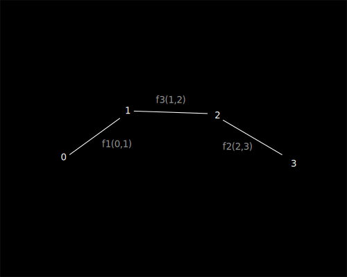

> :information_source: Cоздание универсального пространства любой размерности 
топологии и сложности, следует начинать с пар натуральных чисел и не более.

# Вступление

1. Попробуем создать собственное пространство, максимально простое, не основываясь 
на координатах, измерениях, направлениях и прочих формальных конструктах. Все они 
должны проистекать из базового принципа, но не требовать явного определения.

# Сначало было слово

1. Декларируем [Flumen](./flumen.md)(lat поток, ru поток) - пара натуральных чисел объединенных 
единичным направлением от первого ко второму числу, при этом направление не зависит 
от значения чисел (аналог ориентированного ребра графа), обозначается как F(a,b).

# Да будет пространство

1. Создадим первый флюмен f1 = F(0,1). Он единственное сущее, своим появлением 
порождает собственное одномерное пространство за пределами которго нет ничего.

> :warning: Важно для понимания. Не следует пытаться трактовать все рисуноки 
как координатные пространства в которых размещены точки и связи между ними. 
Рисунки - лишь попытка иллюстрации, флюмены сами неявно формируют пространство.

2. Создаем второй флюмен f2 = F(2,3). Он такж создает собственное пространство, 
не связанное с f0. Невозможно говорить о взаимном положение флюменов и расстоянии 
между ними.

3. Создаем флюмен f3 = F(1,2). При этом все три флюмена объединяются в единое одномерное 
пространство, где каждый флюмен является мельчайшим единичным квантом этого пространства.
Для внутреннего наблюдателя в пространсвте для точек могут быть названы координаты, 
относительно друг друга. Например если точка b[0] то точка d[2]. При этом так как флюмены
однонаправлены, точка a не существует для b и ее координаты не определимы. 

4. Наращивать такое одномерное пространство можно сколь угодно, добавляя к крайним точкам новые.

> :information_source: И это хорошо. 

## Двумерное пространство

1. Добавим еще один флюмен f4 = F(0,3).

2. Из точки числа а = 0 выходят два флюмена, что с точки зрения наблюдателя, находящегося в точке а невозможно объяснить одномерным пространством.. 

2. Так как p0p1 = p0p3 = p1p3 = 1, иными словами они находятся друг от друга наравном расстоянии, то они выходят за одномерного пространства, и создают ограниченное собой двумерное пространство.
3. Можно говорить о координатах. Например относительно p0 возможно определение p1[cos(pi/3);0] и p3[cos(pi/3);sin(pi/3)]. При этом точка p2 имеет одномерную координату p2[2].
4. Важно: точка P2 по прежнему определена только в одномерном пространстве, таким образом в единой модели описаны и двумерные и одномерные пространства.
5. Наращивать такое пространство можно так же сколь угодно, буквально расширяя его добавлением новых точек и связей. 

## Трехмерное пространство и большие размерности

1. Создаем новую точку p4 и добавляем ей связи [ P0, P4, w ], [P1, P4, w], [ p3, p4, w ].

2. По аналогии с двумя измерениями формрируется трехмерное пространтство, где можно говорить о трехмерных координатах для каждой из точек.
3. Таким образом возможно расширение модели до любой размерности.

## Замкнутые конечные пространства

1. Cозданное двумерное пространство точками p0 p2 p3, можно так же интерпритировать как замкнутое одномерное пространство. В случае с тремя точками это не столь очевидно. 
2. Создадим последовательность точек, при этом каждую предыдущую свяжем с последующей а последнюю с первой. Таким образом мы получим замкнутое бесшовное одномерное измерение.

3. Аналогичным образом можно получить замкнутые пространства любой размерности и любой конфигурации, при этом можно говорить о формировании высших измерений.

## Кротовые норы

1. Пространства допускают формирование кротовых нор без нобходимости искривления.

2. Одномерное пространство от точки p0 в точку p7 линейно, равномерно, неразрывно и имеет длинну 7 единиц.
3. При этом связь [p1, p6] добавляет альтернативное линейное неразрываное пространство от точки p0 до p7 длинной 3 единицы.
4. Аналогичный результат достижим для любой размерности.

## Расширение пространства и его кривизна

1. Допустимо произвольное расширение как всего пространства так и его отдельных областей.
Для растяжения достаточно создание новых точек и их связь с двумя соседними с удалением ранее существующей связи.
0. При неравномерном расширении пространства размерностей 2 и более можно говорить о его кривизне через большие измерения.

## Домены

1. Допустимо создание изолированнх областей пространств (доменов), которые могут быть связаны между собой переходами или быть полностью изолированными друг от друга.
В последнем случае они смогут оказывать друг на друга никакого влияния.

## Итог

1. Из ничего мы создали расширяемый многомерное пространство. Пока оно пусто и статичено. 
Хотя мы уже говорили о длинне и рамерах, в пространстве не определено еще время движение и скорость, но они уже близко. 

Да будет свет!

# Ссылки

1. [Флюмен терория](./README.md)
