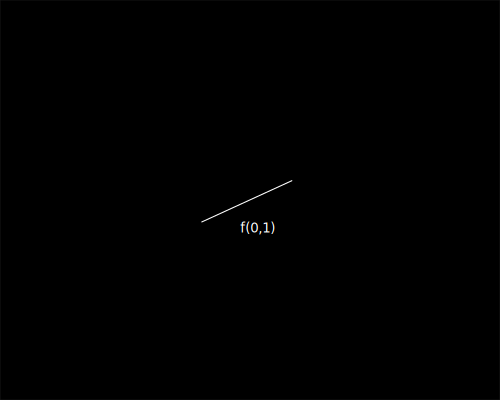

[en](../en/flumen.md)


# Флюмен

[Флюмен](./flumen.md) — абстрактная однонаправленная связь между двумя
[метками](./label.md) `a, b ∈ 𝕃`.



На основе флюмена строится [Флюмен-песочница](README.md). Флюмены
объединяются во [множества](./set.md).


## Полное обозначение

```
f[a,b] для обозначения связи
f[a,i,b] для динамических моделей
```

1. a ∈ 𝕃 — метка начала;
2. b ∈ 𝕃 — метка конца;
3. i ∈ ℕ₀ — значение [информации](./information.md) во флюмене при этом `i = 0`.

> ℹ️  В примерах для наглядности могут использоваться композитные буквенные и 
> индексные обозначения (a, b, c, x₀, t₁), но они всегда являются элементами 𝕃 и 
> не несут числового смысла. Флюмен не имеет координат и не вложен в 
> пространство.


## Сокращенная запись

Для компактного представления множества флюменов используется следующая нотация:

- `a:i>b` — флюмен от метки `a` к метке `b` с информацией `i`, f[a,i,b]
- `a:i>b:i>c` — последовательность из двух флюменов:  f[a,i,b], f[b,i,c]
- `a:i>b:i>c,b:i>d` — последовательность из двух флюменов:  f[a,i,b], f[b,i,c], f[b,i,d]
- `a>b>c,b>d` — последовательность из двух флюменов:  f[a,b], f[b,c], f[b,d]
- `,` — разделитель между независимыми цепочками

## Цепочка или путь

В случае если цепочка включает множество последовательных флюменов, без 
дополнительных ветвлений допустима запись:
```
a|n>b
```
где количество флюменов `n ∈ ℕ` от метки `a` к метке `b` при этом указание 
количества информации не применяется. При развертывании будет сформированы
следующие флюмены 
```
f[a,ab1], f[ab1,ab2], ..., f[abn,b]
```

### Спектр путей

В качестве `n` может быть использовано множество от `k` до `m`, при 
этом `k =< m` и оба натуральные числа

```
n ∈ [k, m], k, m ∈ ℕ, k ≤ m
```
Следующая запись позволяет определить все множество (спектр) путей из флюменов 
от `a` к `b` длиной увеличивающейся от `k` до `m` включительно:

```
a|(k,m)>b 
```
для примера возмем `k=2`, `m=4` в результате будут опредлениы следюущие пути флюменов:

```
a|2>b,
a|3>b,
a|4>b
```

### Свойства флюмена

1. Ориентированность — флюмен f[a, b] и f[b, a] различны при a ≠ b
2. Композиционность — для любых флюменов f[a, b] и f[b, c] существует составной
путь `a → b → c`.
3. Квантовость — флюмен f[a, b] неделим: существует только как полный кортеж.


# Почему флюмен таков

Чтобы получить сложное из простого, необходимы три компонента:

- **Факт** — то, что существует;
- **Причина** — то, откуда возникает сущее;
- **Следствие** — то, куда ведет.

Устранение любого из компонентов разрушает саму постановку: либо не будет 
простого, либо не будет сложного, либо нельзя определить состояние.

В флюмене эти три компонента отражены как:

- **Метка начала** `a` — причина
- **Метка конца** `b` — следствие
- **Информация** `i` — факт

Флюмен — минимальная структура, в которой причина, факт и следствие связаны в 
единое целое, позволяя из простых элементов строить сложные конфигурации.

