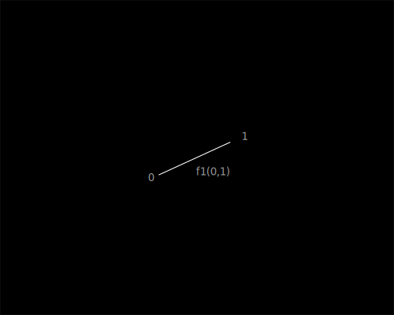

[en](../en/flumen.md)

# Определение Флюмена

Флюмен(lat flumen, rus поток) - пара натуральных чисел (индексы) объединенных единичным 
направлением от первого ко второму числу, при этом направление не зависит от значения 
чисел (аналог ориентированного ребра графа), обозначается как F(a,b). 

На основе флюмена строится [Флюмен-теории](README.md).

# Свойства флюмена

1. Два или более флюменов, обладающих равным индексом в любой конфигурации образуют последовательность.

# Операции над флюменами

1. Над флюменами можно выполнять следующие операции:
    1. Создание
    2. Удаление

