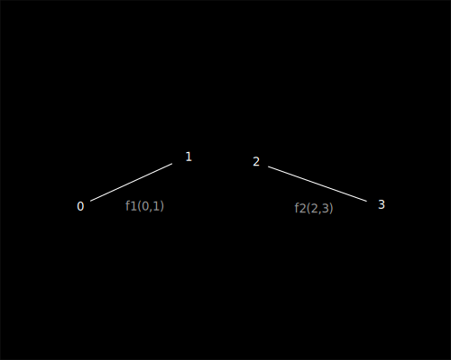

[en](../en/flumen.md)

# Определение Флюмена

Флюмен(lat flumen, rus поток) - пара натуральных чисел объединенных единичным 
направлением от первого ко второму числу, при этом направление не зависит от значения 
чисел (аналог ориентированного ребра графа), обозначается как F(a,b). По сути флюмен
состоит из двух индексов.

На основе флюмена строится [Флюмен-теории](README.md).

# Свойства флюмена

1. Два или более флюменов, обладающих равным индексом в любой конфигурации образуют последовательность.

