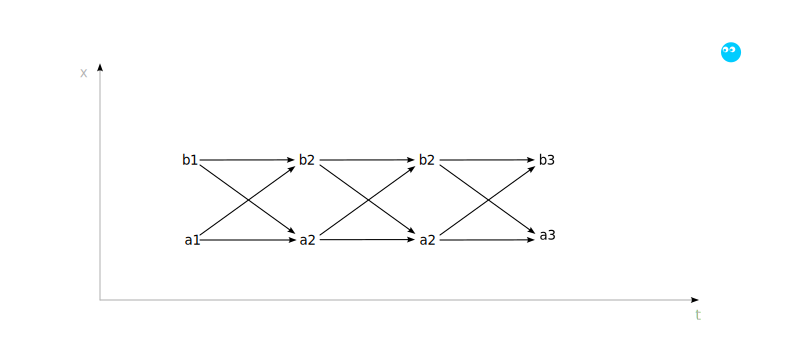
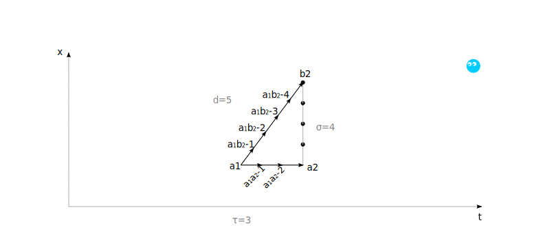

# Вступление

Статья демонстрирует возможность появления эмерджентных свойств аналогичных 
пространству и времени из плоского списка. Показывает, что минимальная 
непротиворечивая метрика дискретного "пространства-времени" требует численного 
отношения между целочисленными временными и пространственными шагами.


# Дисклеймер

Статья — игровая песочница, а не теория всего. Мы исследуем, какие структуры 
возникают из плоского списка с минимальными правилами. Физические термины 
(время, пространство, метрика) используются только для удобства и не претендуют 
на описание реальности.

Текст фиксирует промежуточный этап модели. Вопросы динамики и распространения 
информации требуют отдельного рассмотрения.


# Определения

Начинаем с определений:
- [Метка](#метка)
- [Флюмен](#флюмен)
- [Множество флюменов](#множество-флюменов)


## Метка

[Метка](./lable.md) — элемент счетного множества 𝕃, не имеющий структуры.

[Метки](./label.md) не упорядочены и не наделены числовыми или геометрическими 
свойствами. Служат исключительно для различения объектов и установления связей 
между флюменами.


## Флюмен

> ⚠️  Переопределение понятия, введенного в [первой 
> статье](file:///home/still/downloads/flumen_ru.pdf). Далее используется 
> следующее определение:

[Флюмен](./flumen.md) — абстрактная однонаправленная связь между двумя 
метками `a, b ∈ 𝕃`.

### Обозначение

```
f[a, b]
```

1. a ∈ 𝕃 — метка начала
2. b ∈ 𝕃 — метка конца

> ℹ️  В примерах для наглядности могут использоваться композитные буквенные и 
> индексные обозначения (a, b, c, x₀, t₁), но они всегда являются элементами 𝕃 и 
> не несут числового смысла. Флюмен не имеет координат и не вложен в 
> пространство.

### Свойства флюмена

1. Ориентированность — флюмен f[a, b] и f[b, a] различны при a ≠ b
2. Композиционность — для любых флюменов f[a, b] и f[b, c] существует составной 
путь `a → b → c`.
3. Квантованность — флюмен f[a, b] неделим: существует только как полный кортеж 
`(a, b)`.


## Множество флюменов

Состояние системы — конечное множество флюменов. Отображается
плоским списком, содержащим перечень кортежей флюменов.

```
𝔽 = { f₁[a₁, b₁], f₂[a₂, b₂], …, fₙ[aₙ, bₙ] }
```

### Свойства множества

1. Замкнутость — множество содержит все рассматриваемые флюмены.
0. Дискретность — множество флюменов конечно.

> ⚠️ Важно! Множество флюменов формально эквивалентно ориентированному графу. В 
> дальнейшем мы избегаем термина «граф», чтобы подчеркнуть: никакой геометрии 
> при описани множества не предполагается. Это плоский список пар меток. 
> Структуры (пути, связность) возникают из совпадения меток, а геометрические 
> свойства — результат, а не предпосылка.


# Эмерджентные пространство и время

Опишем множество флюменов `F1`:

```
F1 = 
{
    f₁  [a₁, a₂],   f₂  [a₂, a₃],   f₃   [a₃, a₄],
    f₄  [b₁, b₂],   f₅  [b₂, b₃],   f₆   [b₃, b₄],
    f₇  [b₁, a₂],   f₈  [b₂, a₃],   f₉   [b₃, a₄],
    f₁₀ [a₁, b₂],   f₁₁ [a₂, b₃],   f₁₂  [a₃, b₄]
}
```

На основе композитности интерпретируем, что флюмены образуют три момента времени 
для двух пространственных точек.



При этом флюмены:

- `f₁, f₂, f₃, f₄, f₅, f₆` — движение во времени;
- `f₇, f₈, f₉, f₁₀, f₁₁, f₁₂` — движение в пространстве. 

Таким образом для указанного множества `F1`:

1. Любой путь, это возможная траектория в "пространстве-времени".
0. Все потенциальные траектории уже заложены в структуре.
0. Категорически невозможно перемещение в "пространстве" без перемещения во 
"времени".
0. В точках ветвления возникают равноправные альтернативные пути (их выбор
не принципиален для настоящей статьи и рассматривается отдельно).


# Метрика времени-пространства

Определим метрику "времени" как количество флюменов, необходимое для прохождения 
пути до очередной развилки между "временем" и "пространством".

В `F1` можно выделить два типа маршрутов:

Временной путь — последовательность флюменов вдоль одной метки `a` или `b`. 
Количество флюменов от развилки до развилки — `τ`. Это чистое течение "времени", 
метрика "времени".

"Пространственного" перехода в `F1` не определено. Обозначим этот гипотетический 
переход как `σ` - эмерджентная метрика пространства во флюменах.

"Пространственно-временной" путь, соединяющий разные метки `a` и `b` в разных 
моментах "времени" от развилки до развилки "пространственно-временных" флюменов — 
обозначим как `d`.

При этом: 
1. `τ, d ∈ ℕ` — должны быть целыми положительными числами, так как кванты.
2. `τ = d = 1` следовательно "время" и "пространство" равны по стоимости во 
флюменах.


# Геометрическая интерпретация

Допустим в модели присутствует наблюдатель воспринимающий внутреннее пространство 
в рамках Евклидовой геометрии.


Внешне модель остается дискретной и любой путь измеряется целым числом флюменов.

Рассмотрим два события `A` и `B` произошедших в разных точках и в разное время. 
Пусть они разделены `τ` шагов по времени.


Внутренний наблюдатель в `A` может определить "расстояние" до `B` на основе пути 
`A → B → A1`. Этот путь состоит из двух диагоналей `AB` и `BA1`.

С точки зрения наблюдателя, пытающегося воспринимать пространство время как 
плоскость и применить к пути геометрию Евклида, время между `A` и `A1` по 
указанному пути равно `2√(τ² + σ²)` (в единицах флюменов). 

Соответственно эффективное расстояние для наблюдателя выражается как:
```
σ = √(d² - τ²)
```
Это расстояние не задано в модели явно, но возникает как необходимость для 
непротиворечивой Евклидовой интерпретации, если наблюдатель пожелает 
переместится из `А` в `B` и потратит на это время `τ`.


# Проблема

Для согласованности с дискретной моделью `d` должно быть целым числом, так как 
диагональ — реальный путь, состоящий из целого числа флюменов. Отсюда условие: 
`d² = τ² + σ²` — полный квадрат.

При ранее рассмотренной структуре `τ = 1`, `d = 1` получаем:

`σ = √(1² - 1²) = 0`

Это означает, что в данной конфигурации пространственное разделение событий 
отсутствует — диагональ фактически является чисто временным путем. Для появления 
ненулевого пространства необходимы другие значения `τ` и `d`.


# Решение подбором

Достичь этого можно изменив цену для "времени" и "пространства". Но так как 
флюмен элементарен и не содержит геометрических понятий, мы можем только 
изменить количество флюменов в между развилками "пространства-времени". При этом 
мы по прежнему оперируем дискретным квантами.

Нужны такие `τ, σ, d`, чтобы `d = √(τ² + σ²)` было целым, так же положим, что 
`τ, d` должны быть минимальными для минимизации списка флюменов.

Решим задачу подбором ближайших минимальных значений:

```
τ = 1, σ = 1,   √(1² + 1²) = √2 ∉ ℕ (не подходит)
...
τ = 3, σ = 4,   √(9 + 16) = 5 ∈ ℕ (минимальное решение)
τ = 4, σ = 3,   √(16 + 9) = 5 ∈ ℕ (симметричное решение)
...
τ = 6, σ = 8  → √(36 + 64) = 10 ∈ ℕ (кратное 3:4 не оптимально)
```

Минимальное решение, дающее квантованную (целую) диагональ и ненулевое 
пространственное разделение — `τ = 3, σ = 4, d = 5` (или симметричное `τ = 4, σ 
= 3, d = 5`).

Пример множества F2 приведен ниже.

```
F2 = 
{
    f₁[ a₁,     a₁a₂_1 ]
    f₂[ a₁a₂_1, a₁a₂_2 ]
    f₃[ a₁a₂_2, a₂ ]
    f₅[ a₁,     a₁b₂_1 ]
    f₆[ a₁b₂_1, a₁b₂_2 ]
    f₇[ a₁b₂_2, a₁b₂_3 ]
    f₈[ a₁b₂_3, a₁b₂_4 ]
    f₉[ a₁b₂_4, b₂ ]
}
```




# Выбор интерпретации

В модели временной шаг `τ` соответствует движению «ничего не делая» — простому 
течению времени вдоль одной метки без смены пространственной привязки. 
Пространственный шаг `σ` — эмерджентная гипотетическая величина, вычисляемая из 
диагонали.

Полученные решения `(τ, σ) = (3,4) и (4,3)` симметричны. Выбор между ними — 
вопрос интерпретации: какой из двух типов путей мы называем временем.

Если считать, что время — это то, что течет даже при отсутствии 
пространственного перемещения, то имеет смысл взять за `τ` минимальную метрику. 
В этом случае `τ = 3`, `σ = 4`. Однако это именно интерпретационная условность 
модели, а не ее жесткое требование. Сама модель допускает оба варианта. 
Возможно, в будущем будет обнаружена причина для изменения композиции и 
размерности весов, но не их соотношения как пифагоровой тройки.


# Вывод

Эмерджентное время-пространство возникающее, но явно не заданное в плоском 
списке ориентированных пар (флюменов) допускает непротиворечивую Евклидову 
интерпретацию как минимум в отношении построения плоского пространства-времени.

Если в дискретной модели требовать, чтобы Евклидова диагональ `d = √(τ² + σ²)` 
измерялась целым числом а "пространство" и "время" образовывали плоскость, то 
метрики "времени" и "пространства" а также перемещение (параметры `τ`, `σ`, 
`d`) обязаны образовывать пифагорову тройку. Минимальное решение этого условия — 
`(3,4,5)` или `(4,3,5)`.

Композитное перемещение «вдоль времени» и «вдоль пространства» не ломает 
квантовость фактических путей (число флюменов), и модель остаётся внутренне 
непротиворечивой. Минимальная согласованная анизотропия временного и 
пространственного шага в такой модели равна 3:4 (или 4:3).

Соотношение квантов времени и пространства 3:4 (обратное или кратное) допускает 
проявление эффектов Евклидовой геометрии внутри группы ориентированных объектов.

При увеличении размерности пространства на основе представленной структуры можно 
построить фигуры, аналогичные окружностям. Отношение длины такой фигуры к ее 
диаметру при стремлении размера к бесконечности сходится к некоторому числу. 
Предположительно, это число совпадает с π, что потребовало бы отдельного 
исследования. Если это подтвердится, дискретные флюмены окажутся способны 
порождать иррациональные константы как эмерджентное свойство, без их явного 
задания в модели. Приближение к числу `π` в пределе (если оно действительно 
возникает при построении «окружностей») — это не фундаментальная константа 
модели, а следствие выбранного соотношения 3:4 между временным и 
пространственным квантом. Измени соотношение — изменится и предельное значение 
`π`.

Все перечисленное не необходимость модели, а минимальное условие целочисленной 
Евклидовой совместимости в дискретной структуре.

Движущийся внутренний наблюдатель (больше пространственных шагов σ за 
фиксированное τ) накапливает больше событий → стареет быстрее. Обратный эффект 
(замедление старения при движении) в этой конфигурации невозможен, так как 
диагональ всегда длиннее временного пути.

Однако топология пространства-времени определяется только множеством флюменов. В 
следующих работах планируется показать, как изменение композиции флюменов 
позволяет получать иные метрики и неевклидовы эффекты без явного задания 
геометрии.

