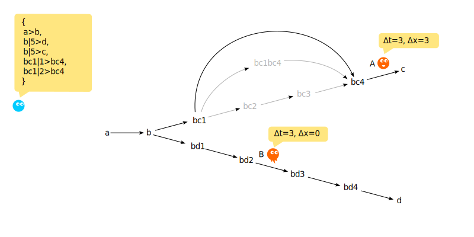
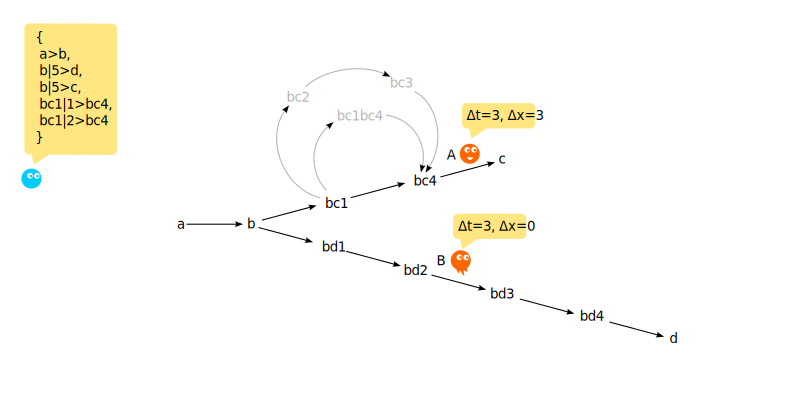

# Вступление

В [предыдщей статье](./flumen_evklid.md) показана возможность проявления 
эмерджентных свойств евклидова "пространства" во [множестве флюменов](./set.md).

Данная статья рассматривает возможность проявления релятивистских эффектов на 
тех же описательных принципах. Мы показываем, что наличие множества путей разной 
длины между двумя метками, а также прямых («фотонных») переходов, приводит к 
эффектам, аналогичным замедлению времени и относительности одновременности — без 
введения дополнительных постулатов, исключительно за счёт топологии.


# Определения

Начинаем с определений:

1. [Метка](./label.md)
0. [Флюмен](./flumen.md)
0. [Множество флюменов](./set.md)


# Рассуждения

В [предыдщей статье](./flumen_evklid.md), демонстрируя проявление свойств 
евклидова пространства, мы столкнулись с эффектом, что «время» для движущегося 
объекта идёт быстрее, чем для покоящегося.

Это следствие того, что в модели время отождествляется с количеством пройденных 
флюменов: движущийся объект вынужден проходить более длинные пути между теми же 
метками, а значит — делать больше шагов и «проживать» больше тактов.

Однако такой эффект не соответствует наблюдаемым явлениям в физическом мире, где 
движущиеся объекты (относительно неподвижных) демонстрируют замедление 
собственного времени.


Покажем, что на основе исключительно плоского списка возможно построение 
пространства с неевклидовой геометрией, где соотношения длин путей будут иными. 
Изменяя топологию связей между метками, можно влиять на метрику возникающего 
пространства — вплоть до появления эффектов, аналогичных релятивистскому 
замедлению времени.


## Минимизируем "время" на максимальной сокрости

Нам необходимо сделать «время» покоя максимальным, а «время» движения 
минимальным. 

Из этого следует, что на максимально возможной возможной "скорости", время в "пути"
из любой точки «пространства» в любую сколь угодно удалённую должно быть 
минимальным. Во флюмен-модели минимальным "временем" взаимодействия является 1 
квант. Ноль рассматривать невозможно, так как при нуле квантов нет передачи 
информации, что противоречит самой задаче передачи.

Следовательно, для любой пары точек в нашем будущем "пространствd" A и B во 
множестве флюменов должен существовать один прямой флюмен. Только при 
таком условии максимальная "скорость" (аналог скорости света) реализуется для 
любого расстояния, и "время в пути" всегда остаётся минимально возможным — один 
такт.


# Эмерджентное пространство

Опредленим двух наблюдатеелй A и B.
Определим для них пути во [множестве флюменов](./set.md) `F₁`:

```
F₁ += 
{ 
    a>b, 
    b|n>d,
    b|n>c,
    bc1|1>bc4,
    bc1|2>bc4
}
```
При этом возмем `n=5`.

Будем интерпритировть путь `А` как движение во времени-пространстве, а путь `B` 
как движение только во времени от одного флюмена. 
Статья [об евклидовом простраснтве](./flumen_evklid.md) показывает как из 
топологии возникают эти различия.



Отразим оба пути для `А` и `Б` с точки зрения времени.


