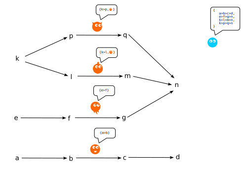

# Наблюдатели

[en](../en/observers.md)

---

[Флюмен-песочница](README.md) описывает наблюдателей:

1. [Внутренний наблюдатель](#внутренний-наблюдатель) - причина множества 
[флюменов](./flumen.md).
0. [Внешний наблюдатель](#внешний-наблюдатель) - следствие множества 
[флюменов](./flumen.md).

## Внешний наблюдатель

Внешний наблюдатель — внемодельный субъект, способный прямо взаимодействовать с 
моделью на уровне [множества флюменов](./flumen.md), Он может формировать любые 
списки флюменов исходя из собственных задач. Внешний наблюдатель имеет 
вомзожность менять любые правила формирования изменения флюменов но только для 
всего множества сразу.

Обозначение `Α`

Внешний наблюдатель воспринимает систему целиком как абстракцию, оценивает её 
свойства извне, понимает её устройство и функционирование без привязки к 
локальным измерениям.

Для внешнего наблюдателя топология не дана непосредственно в данных — она 
требует вычисления (поиск циклов, компонент связности, инвариантов и т.д.), 
поэтому без целенаправленного анализа может остаться незамеченной.

Роль внешнего наблюдателя может выполнять функция или конечный автомат.

# Внутренний наблюдатель

Внутренний наблюдатель — устойчивое повторяющееся, подмножество [множества 
флюменов](./set.md), являющееся результатом предыдущих путей (память). 
Наблюдатель является причиной последующего распространения информации.

Обозначение: `S ⊂ F`

Наблюдатель особая конфигурация, хранящая следы своего прошлого. Факт наличия 
такой структуры и есть "наблюдение". Наблюдатель не "помнит о прошлом", а 
является структурой, которая стала такой, потому что его сформировали прошлые 
пути.

Внутренний наблюдатель полностью определяется внутренними свойствами 
пространства. Все характеристики — координаты, длины, размеры, направления — 
доступны только через взаимодействие с элементами модели. Для внутреннего 
наблюдателя пространство существует только как совокупность отношений квантов 
информации. Он не способен выйти за рамки этих отношений или прямо детектировать
существование квантов.

Внутренних наблюдателей может быть множество и у каждого будет свое 
представление о его "реальности".

# Примечание

Для мысленных экспериментов в рамках песочницы допустимо представлять наблюдателя
в качестве одного флюмена. Его минимальная функция, являтся последовательным
результатом всех предыдущих состояний.

---

## Сознание в модели

В рамках модели сознание отождествляется с внутренним наблюдателем — устойчивой 
структурой флюменов, обладающей:

- Памятью — частичным отражением предыдущих структур в своей топологии (следы 
пройденных путей)
- Самореференцией — наличием информации о собственном прошлом, зафиксированной в 
текущей конфигурации
- Причинностью — способностью на основе хранимой информации выступать источником 
построения иных конфигураций квантов информации

Никаких для дополнительных сущноcтей для объясения "сознания" не 
предусматривается. То, что в философии называют "сознанием", здесь есть просто 
свойство определенного класса топологических структур — способность хранить 
информацию о прошлом и окружении, где эта информация является основой для 
будущего — последующих путей распространения информации.

"Сознание" не добавляется к множеству извне — оно возникает как эмерджентное 
свойство достаточной сложности и устойчивости. Вопрос "почему эта структура 
обладает сознанием" в рамках модели эквивалентен вопросу "почему эта структура 
обладает данной топологией" — это следствие предыдущего распределения квантов 
информации по флюменам.
